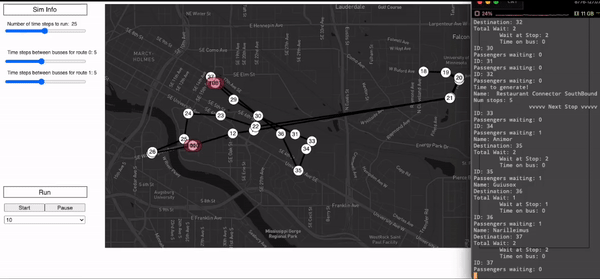

# Visual Transit System Simulator

[](./LICENSE)

## Table of contents

- [Overview](##overview)
- [Directory Structures](##directory-structures)
- [Features](##features)
- [Dependencies](##dependencies)
- [Building](##building)
- [Running](##running)
- [Testing](##testing)
- [Code Style](##code-style)
- [Documentation](##documentation)
- [Contributors](##contributors)
- [License](##license)

## Overview

The simulation system models bus transit around the University of Minnesota campus, and can display the routings and statistics on a webpage in a timely manner.

### System Architecture


### Demo



## Directory Structures

+ `config`: Contains `config.txt` which is a configuration file for bus stops and routes used by the transit simulation system, can be customized.
+ `cpplint`: Automatic Google Style cpplint script.
+ `docs`: Documentation files and images.
+ `drivers`: Contains source code with the main function that is used to create the drivers files for entities in the simulation system.
+ `googletest`:GoogleTest suits for unit testing and regression testing.
+ `src`: Directory that contains all the source code (.cc AND .h) for the backend simulator.
+ `test`: Directory of creating unit tests, using [Google Test](https://github.com/google/googletest) framework.
+ `build`: Created by `Makefile`, containing all the executables.
+ `web_code`: Source code for the web server used to enable communication between the visualization component and the backend simulation system.
+ `web_graphics`: Frontend HTML/CSS/JavaScript source code used to render the web page. It enables to configure and run the transit simulation system from the local browser.

## Features

- [X] Visualization on a web page
- [X] Functionality to Pause / Resume
- [X] Logging the statistics
- [X] Runtime behavior modificaiton at runtime
- [ ] Linking to an external database server
- [ ] Deploying on the clound

## Dependencies

+ `g++`
+ `node`
+ `npm`

## Building

The project can be compiled across different platforms using `Makefile`. However, to enable most of the features and functionalities of the system. It recommended to compile it on a Linux machine. Then we can run the simulation system and the web server on a Linux machine and access it via a browser on a different platform (Linux, OSX, Windows, or even on a mobile).

To compile and build the program, it is as simple as:

```bash
$ cd src
$ make
```

The built executable will be located in `./build/bin/`, named `vis_sim`.

## Running

To run the simulation and start the web server:

```bash
$ ./build/bin/vis_sim <port_number>
```

The `port_number` is of your choice and should be a legal one (typically starting from 8000).

Then run your local browser (Firefox/Chrome are guaranteed to have the best performance), and enter following address:

```bash
https://127.0.0.1:<port_number>/web_graphics/project.html
```

You will be directed to the main page of the simulation visualizer and you can play with it!

## Testing

All test cases are created with Google Test.

### Unit Tests

```bash
# Example usage
$ cd tests
$ make
$ ../build/bin/unittest
```

### Regression Tests

```bash
# Example usage
# The output of diff command should be silent
$ cd src
$ make regression_test
$ cd ../build/bin
$ ./regression_test > [log_file1]
$ ./regression_test > [log_file2]
$ diff [log_file1] [log_file2]
```

## Code style

The code in this project is [Google Style](https://google.github.io/styleguide/cppguide.html) compliant and uses [cpplint](https://github.com/google/styleguide/tree/gh-pages/cpplint) for linting.

For style check, do the following

```bash
$ ./cpplint/cpplint.py [path_target_dir] [file_name]
# Example usage
$ cd src
$ ../cpplint/cpplint.py *.cc *.h
```

## Documentation

`Doxygen` is used to generate documentation and UML for this project. The steps are following

1. Navigate to the `docs` directory.

```bash
$ cd docs
```

2. Generate the `html` pages and `latex` files for the documentation.

```bash
$ doxygen Doxyfile
```

3. Open the `index.html` file inside the `docs/html` directory in a browser which is the main page of the documentation.

## Contributors

[Zecheng Qian](https://aden-q.github.io/) - qian0102@umn.edu

## License

[MIT License](LICENSE)
